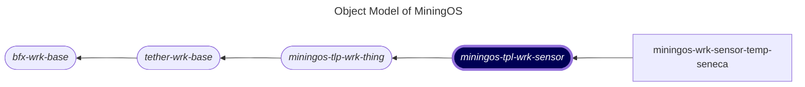

# miningos-tpl-wrk-sensor

## Table of Contents

1. [Overview](#overview)
2. [Object Model](#object-model)
3. [Architecture](#architecture)

## Overview

`miningos-tpl-wrk-sensor` is an **abstract base worker** for sensor devices in the MiningOS Bitcoin mining infrastructure ecosystem. This template provides the foundation for implementing concrete sensor workers (temperature, humidity, etc.) that are critical for monitoring and maintaining optimal mining operations.

### Key Characteristics

- **Abstract Template**: Serves as base class for concrete sensor implementations
- **Real-Time Data Collection**: Collects sensor readings every 10 seconds via scheduled stats
- **Distributed Architecture**: Supports rack-based sharding for horizontal scaling
- **RPC Communication**: Full-featured RPC interface for remote management
- **Hypercore Storage**: Uses Hyperbee for efficient time-series data storage
- **Alert System**: Built-in alert processing and monitoring capabilities


## Object Model

The following is a fragment of [MiningOS object model](https://docs.mos.tether.io/) that contains the concrete class representing **Sensor workers** (highlighted in blue). The rounded nodes reprsent abstract classes and the square nodes represents a concrete classes:



Check out [miningos-tpl-wrk-container](https://github.com/tetherto/miningos-tpl-wrk-container) for more information about parent classes.


## Architecture

### BaseSensor Class (`workers/lib/base.js`)

The core sensor abstraction class that extends `BaseThing` from the parent template.

**Key Features:**
- **Real-Time Data**: `getRealtimeData()` method for frequent polling
- **Snap Preparation**: Calls `_prepSnap()` for data collection

### WrkSensorRack Class (`workers/rack.sensor.wrk.js`)

The main worker orchestrator that manages sensor lifecycle and data collection.

**Key Features:**
- **Real-Time Data Scheduling**: Collects data every 10 seconds (`rtd` schedule)
- **Thing Type Definition**: Identifies as 'sensor' type
- **Stats Integration**: Defines sensor-specific statistics operations

**Configuration:**
```javascript
scheduleAddlStatTfs = [
  ['rtd', '*/10 * * * * *']  // Real-time data every 10 seconds
]
```
